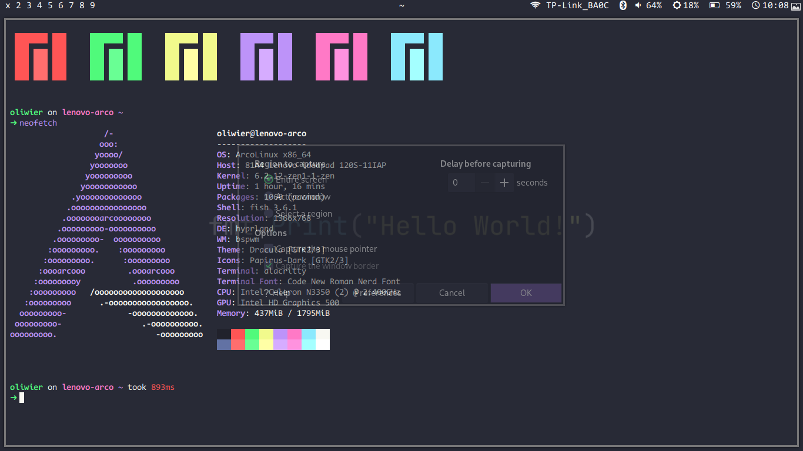
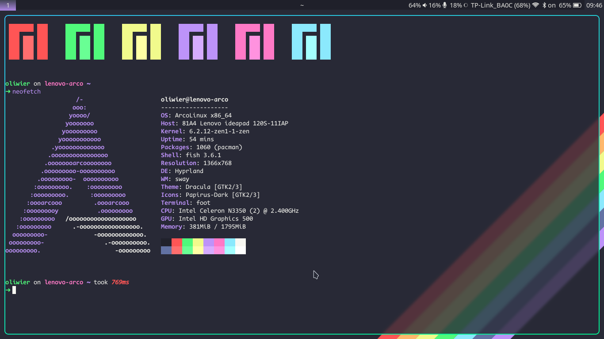

# dotfiles
NOTE: This is meant for Arch based distros. I don't know if the dependencies will be available for other distros.

My [bspwm](https://github.com/baskerville/bspwm) config.

I also have [hyprland](https://github.com//hyprwm/hyprland).

## TODO
bspwm:
- adding convenient install script

hyprland:
- adding convenient install script
