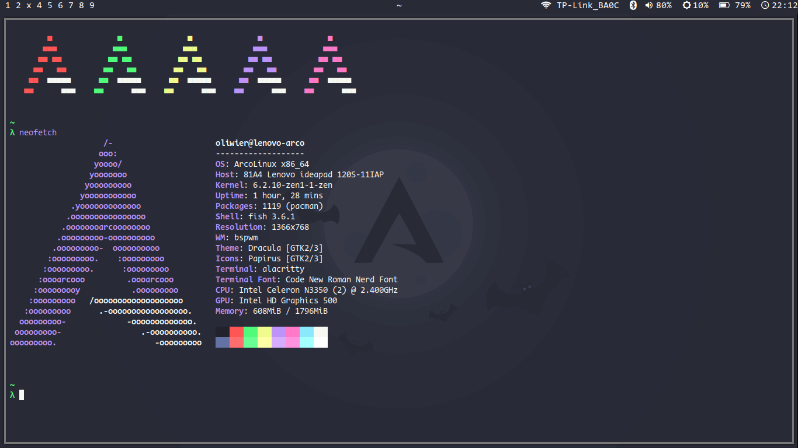

# dotfiles
NOTE: This is meant fore Arch based distros. I don't know if the dependencies will be available for other distros.

My [bspwm](https://github.com/baskerville/bspwm) config. I also have [hyprland](https://github.com//hyprwm/hyprland) (though it's WIP).

## TODO
bspwm:
- nothing (probably)

hyprland:
- implementing a screenshot tool
