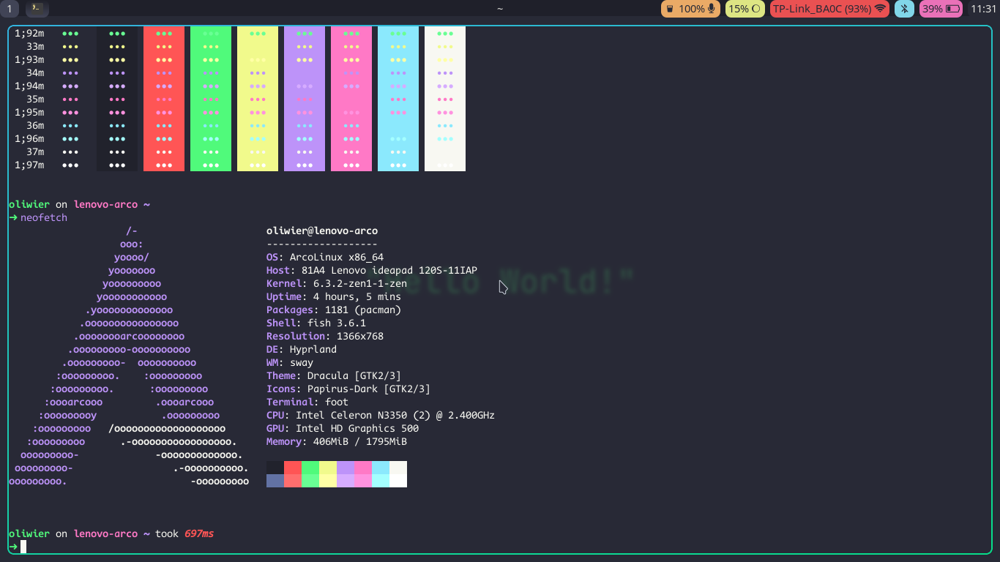

# dotfiles
# WARNING:
This is meant for Arch based distros. Dependencies might not be available for other distros.

## [bspwm](https://github.com/baskerville/bspwm)

Type of program | my default choice
------- | --------
Terminal Emulator | [alacritty](https://github.com/alacritty/alacritty)
Shell | [Fish](https://github.com/fish-shell/fish-shell)
File Manager | pcmanfm
Web Browser | firefox
editor (IDE or something) | [Emacs](https://www.gnu.org/software/emacs/) ([doom emacs](https://github.com/doomemacs/doomemacs))
Bar | [polybar](https://github.com/polybar/polybar)
Launcher | [rofi](https://github.com/davatorium/rofi)
Compositor | [picom](https://github.com/yshui/picom)

## [hyprland](https://github.com//hyprwm/hyprland)

Type of program | my default choice
------- | --------
Terminal Emulator | [foot](https://codeberg.org/dnkl/foot)
Shell | [Fish](https://github.com/fish-shell/fish-shell)
File Manager | pcmanfm
Web Browser | firefox
editor (IDE or something) | [Emacs](https://www.gnu.org/software/emacs/) ([doom emacs](https://github.com/doomemacs/doomemacs))
Bar | [Waybar](https://github.com/Alexays/Waybar)
Launcher | [rofi](https://github.com/davatorium/rofi)
Compositor | [Hyprland](https://github.com/hyprwm/Hyprland)

---

# INSTALLING
Go into `install` folder and execute `main.sh`. The script will overwrite some folders in `~/.config` so make sure to make an backup.

---
---

# THEMES
Available themes are: Dracula, Catppuccin Mocha, Catppuccin Latte.
In order to change between them you need to execute script which should be in `home/.config/scripts/themes/main.sh`.
In bspwm and hyprland (if dotfiles were applied correctly) you can bring them up by `super+F6`.
Not everything changes out of the box (like notification daemon and panel) so rebooting or logging out of your machine is recommended move after chaning theme.

---
---
# TODO
- good (for me) neovim config
- adding catppuccin wallpapers script
- adding gtk3 theme changing in bspwm
