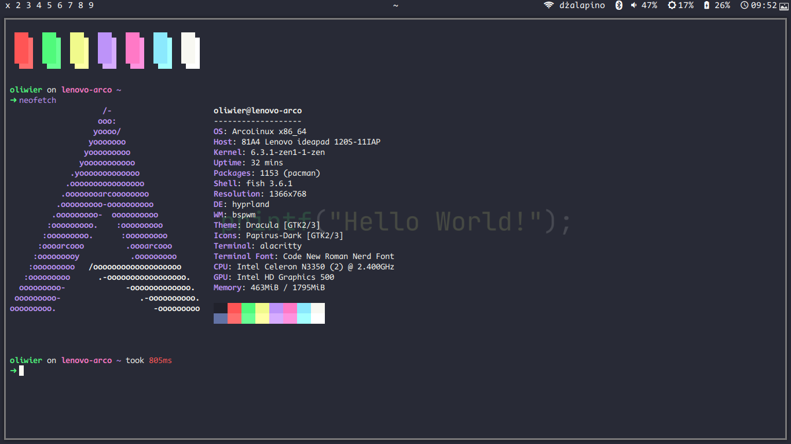

# dotfiles
## WARNING:
This is meant for Arch based distros. I don't know if the dependencies will be available for other distros.

My [bspwm](https://github.com/baskerville/bspwm) config.

Type of program | my default choice
------- | --------
Terminal Emulator | [alacritty](https://github.com/alacritty/alacritty)
Shell | [Fish](https://github.com/fish-shell/fish-shell)
File Manager | pcmanfm
Web Browser | firefox
editor (IDE or something) | [Emacs](https://www.gnu.org/software/emacs/) ([doom emacs](https://github.com/doomemacs/doomemacs))
Bar | [polybar](https://github.com/polybar/polybar)
Launcher | [rofi](https://github.com/davatorium/rofi)
Compositor | [picom](https://github.com/yshui/picom)

I also have [hyprland](https://github.com//hyprwm/hyprland).

Type of program | my default choice
------- | --------
Terminal Emulator | [foot](https://codeberg.org/dnkl/foot)
Shell | [Fish](https://github.com/fish-shell/fish-shell)
File Manager | pcmanfm
Web Browser | firefox
editor (IDE or something) | [Emacs](https://www.gnu.org/software/emacs/) ([doom emacs](https://github.com/doomemacs/doomemacs))
Bar | [Waybar](https://github.com/Alexays/Waybar)
Launcher | [rofi](https://github.com/davatorium/rofi)
Compositor | [Hyprland](https://github.com/hyprwm/Hyprland)

---

## INSTALLING
In folder `install` there is `main.sh`. Execute that script to choose bspwm or Hyprland. The script will delete everything in `~/.config` so make sure to make an backup.

---
---

## TODO
- adding catppuccin wallpapers script
