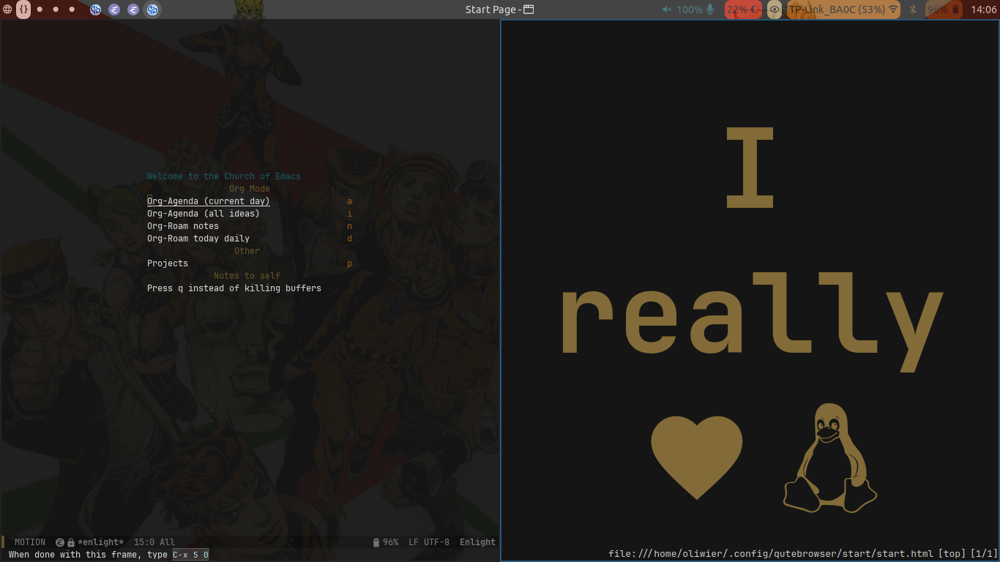
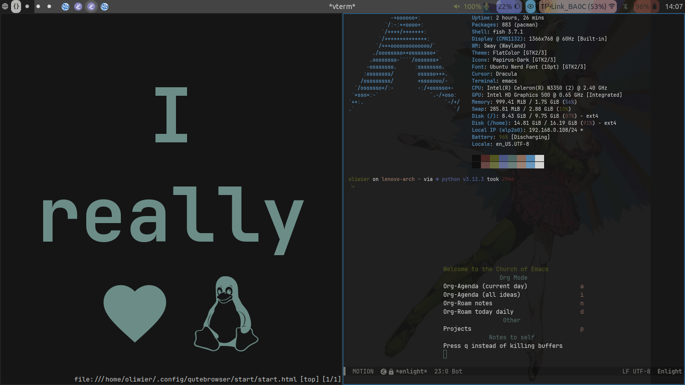

#+TITLE: dotfiles
#+STARTUP: noinlineimages

* WARNING
This is meant for [[https://archlinux.org/][Arch]] based distros. Though I have WIP NixOS config (which is probably broken at this point). Dependencies might not be available for other distros.
* pywal with sway

| Type of program           | My default choice         |
|---------------------------+---------------------------|
| Terminal Emulator         | [[https://codeberg.org/dnkl/foot][foot]]                      |
| Shell                     | [[https://github.com/fish-shell/fish-shell][Fish]]                      |
| File Manager              | dired (in Emacs), pcmanfm |
| Web Browser               | [[https://glide-browser.app/][Glide]]                     |
| editor (IDE or something) | [[https://www.gnu.org/software/emacs/][Emacs]]                     |
| Bar                       | [[https://github.com/Alexays/Waybar][Waybar]]                    |
| Launcher                  | [[https://github.com/davatorium/rofi][rofi]]                      |
| Window Manager            | [[https://github.com/swaywm/sway/][sway]]                      |

At sway's startup the script [[file:.local/bin/pyrice][~/.local/bin/pyrice]] will be executed.
By default it's not there but the installation script compiles it and puts it there.
It will use a image file as a argument, or a directory and choose random file from there.
You can execute the script from terminal or by pressing =Super+ALT+R= or from script hub by pressing =Super+Shift+Enter=.
* INSTALLING
Go to [[file:install/README.org][install/README.org]] to look at the dependencies and other necessary steps to set up the rice.
** CONFIG FILES
Copy/move all files to your =$HOME= directory.

Another way to manage this conveniently is to install [[https://www.gnu.org/software/stow/][stow]].
1. Move cloned repo into =~/repo-name=.
2. Backup your =~/.config= and delete everything inside if necessary.
3. Inside repo directory do =stow .=
This will link all files automatically to its corresponding places.
